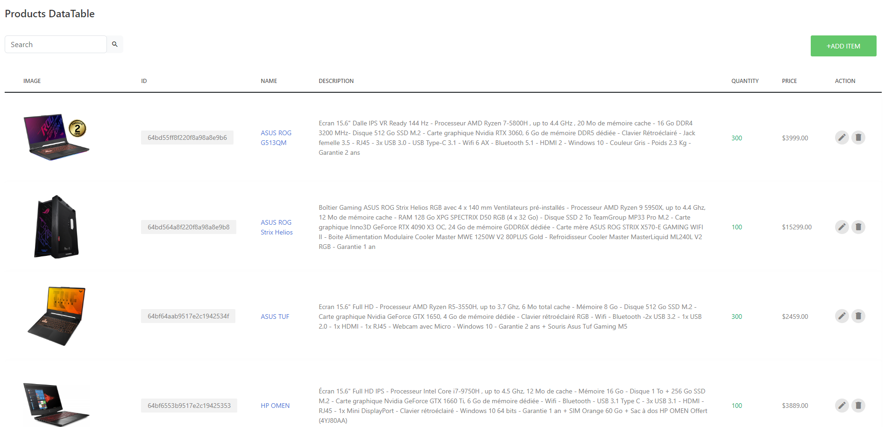
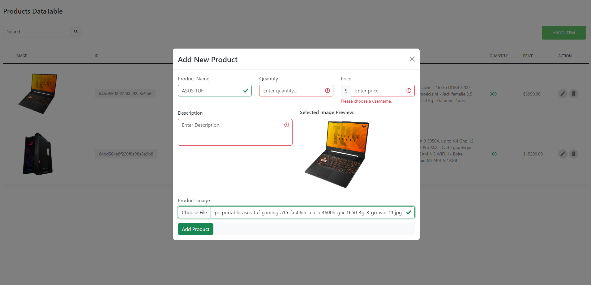
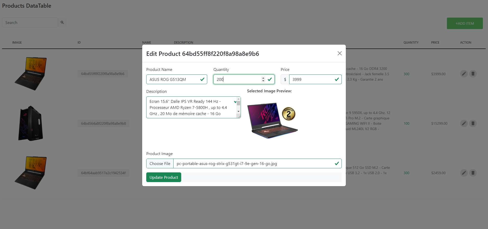
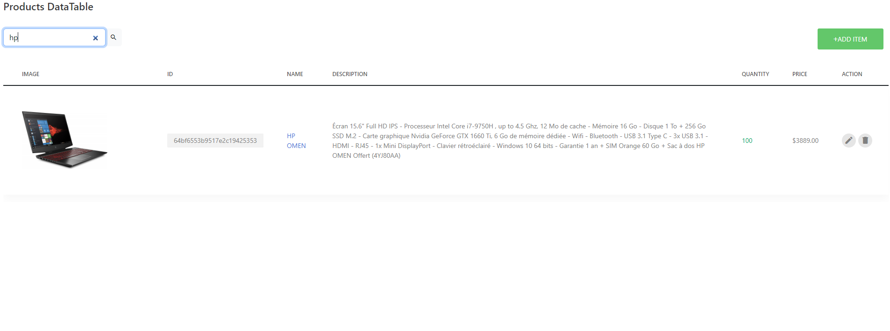

  <h1>CRUD Mini Project with React.js and Node.js</h1>
  
The CRUD Mini Project is a web application built using Node.js and React.js, designed to showcase the fundamental CRUD operations (Create, Read, Update, Delete and Search). The project aims to demonstrate how to interact with a backend server using Node.js while building a interactive frontend data table with React.js.

## Table of Contents

- [Features](#features)
- [Screenshots](#screenshots)
- [Technologies Used](#technologies-used)
- [Installation](#installation)
- [Usage](#usage)
- [Contributing](#contributing)
- [License](#license)

## Features

- **Create:** Users can add new product records to the data table, including images.
- **Read:** The application fetches and displays existing product data in a clean and organized data table.
- **Update:** Users can edit and update product details, including product images.
- **Delete:** The application allows users to delete unwanted product records from the data table.
- **Search:** Users can search and filter products based on specific criteria.

## Frontend Screenshots

  
  
Caption for Screenshot 1

  
  
Caption for Screenshot 2

  
  
Caption for Screenshot 2

  
  
Caption for Screenshot 2

## Technologies Used

- **React.js:** A powerful JavaScript library for building interactive user interfaces.
- **Node.js:** A versatile JavaScript runtime for server-side development.
- **Express.js:** A fast and minimalist web application framework for Node.js.
- **MongoDB:** A NoSQL database for storing product data and images.
- **Multer:** A middleware for handling multipart/form-data, allowing image uploads.
- **Axios:** A promise-based HTTP client for making API requests from the frontend to the backend.
- **Bootstrap:** A popular CSS framework for creating responsive and visually appealing web applications.

## Backend Repository

For the backend code of this project, visit the [Backend Repository](https://github.com/your-username/your-backend-repo).

## Installation

1. Clone the repository: `git clone https://github.com/your-username/your-repo.git`
2. Navigate to the project directory: `cd react-products`
3. Install frontend dependencies: `npm install`
4. Start the React frontend: `npm start`

